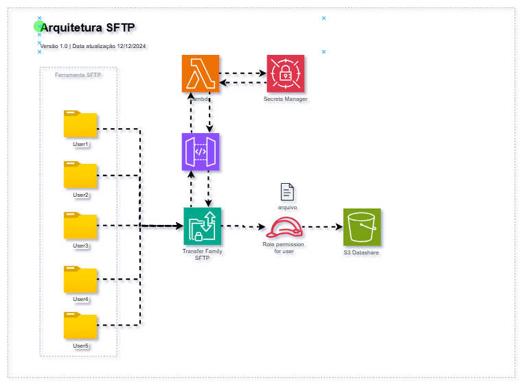

# Arquitetura SFTP com Controle de Permissões e Integração AWS
Essa arquitetura detalha uma solução de ingestão de arquivos SFTP com controle de permissões personalizadas e integração segura entre diversos serviços da AWS.

### Componentes e Fluxo:
1. Usuários SFTP (User1 a User5):

    * Representam as entidades ou usuários que enviam arquivos para o sistema via protocolo SFTP.

2. AWS Transfer Family (SFTP):
    * Fornece o endpoint SFTP usado pelos usuários para transferir arquivos.
    * Os arquivos enviados são associados a permissões específicas configuradas para cada usuário.

3. Amazon S3 (S3 Datashare):

    * Serve como o repositório principal para armazenar os arquivos recebidos.
    * Cada arquivo transferido para o S3 é acessado de acordo com permissões configuradas (IAM Role).

4. Funções Lambda:

    * 1ª Função: Configuração e gerenciamento dinâmico de usuários e permissões. Interage com o Secrets Manager para recuperar credenciais ou configurações sensíveis.
    * 2ª Função: Processa eventos relacionados aos arquivos transferidos, como validação ou integração com outros sistemas.

5. AWS Secrets Manager:

    * Gerencia segredos (como credenciais SFTP) e configurações sensíveis, garantindo segurança durante a interação entre componentes.

6. IAM Role Permission for User:

    * Cada usuário recebe permissões específicas para acessar ou transferir dados.
    * Essa política é aplicada dinamicamente, assegurando que o controle seja granular e seguro.

### Cenário Operacional:
  * Os usuários enviam arquivos para o AWS Transfer Family via SFTP.
  * Com base nas permissões configuradas, os arquivos são armazenados em um bucket S3, categorizados por políticas específicas de acesso.
  * Funções Lambda são ativadas para:
    * Configurar e gerenciar permissões dinâmicas para os usuários.
    * Realizar tarefas de pós-processamento, como validação, auditoria ou distribuição de dados.
  * O Secrets Manager é usado para garantir que credenciais sensíveis sejam acessadas de forma segura.

  Essa arquitetura adiciona um controle refinado sobre permissões de acesso (IAM Role) enquanto mantém a segurança e a escalabilidade na AWS.